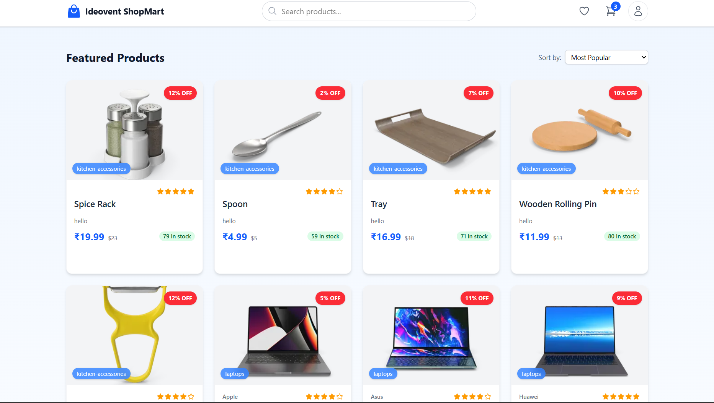

# ShopMart - Responsive E-commerce Product Page

A modern, responsive e-commerce product page built with React, Vite, and Tailwind CSS v4.1. This project showcases a clean, professional design with features typically found in high-quality e-commerce websites.

##### Page-1



##### Page-2


##### Page-3


## 🚀 Features

-   **Responsive Design**: Fully responsive layout that works on mobile, tablet, and desktop screens
-   **Product Grid**: Attractively displays product cards with images, titles, prices, and ratings
-   **Product Details**: Detailed product view with image gallery, description, specifications, and "add to cart" functionality
-   **Pagination**: Simple, classic pagination system with numbered buttons and previous/next navigation
-   **Modern UI**: Clean, professional interface with smooth animations and transitions
-   **Data Fetching**: Integration with DummyJSON API to display real product data
-   **Routing**: Uses React Router for navigation between product listing and product details pages

## 📋 Prerequisites

-   Node.js (v18 or higher recommended)
-   npm or yarn package manager

## 🛠️ Installation

1. Clone the repository:

    ```bash
    git clone https://github.com/yourusername/shopmart.git
    cd shopmart
    ```

2. Install dependencies:

    ```bash
    npm install
    # or
    yarn
    ```

3. Start the development server:

    ```bash
    npm run dev
    # or
    yarn dev
    ```

4. Open your browser and visit `http://localhost:5173`

## 🏗️ Project Structure

```
Responsive Product Page/
├── public/
│   └── vite.svg
├── src/
│   ├── assets/
│   │   └── react.svg
│   ├── components/
│   │   ├── Pagination.jsx    # Pagination component with prev/next and numbered buttons
│   │   ├── ProductDetail.jsx # Detailed view of a single product
│   │   └── ProductsCard.jsx  # Product card for the grid view
│   ├── App.css
│   ├── App.jsx               # Main application component with routing
│   ├── index.css             # Global styles and Tailwind imports
│   └── main.jsx              # Entry point
├── .eslintrc.js
├── index.html
├── package.json
├── README.md
└── vite.config.js
```

## 🧩 Components

### ProductsCard

Displays product information in a card format for the grid view, including:

-   Product image
-   Title and category
-   Price with discount (if applicable)
-   Rating
-   Quick "Add to Cart" button

### ProductDetail

Shows detailed information about a selected product:

-   Image gallery
-   Product title, brand, and category
-   Price information with discounts
-   Detailed description
-   Specifications
-   Quantity selector
-   "Add to Cart" and "Buy Now" buttons
-   Shipping and return information

### Pagination

A classic, user-friendly pagination component:

-   Numbered page buttons
-   Previous (⏮️) and next (⏭️) navigation
-   Disabled state styling when at first or last page
-   Active state highlighting for current page
-   Smooth scroll to top when changing pages

## 🔧 Technologies Used

-   **React 19.1**: For building the user interface
-   **Vite 6.3**: Fast build tool and development server
-   **React Router 7.6**: For page routing and navigation
-   **Tailwind CSS 4.1**: Utility-first CSS framework for styling
-   **DummyJSON API**: For fetching mock product data

## 📱 Responsive Design

The application is fully responsive with breakpoints for:

-   Mobile: < 640px
-   Tablet: 640px - 1024px
-   Desktop: > 1024px

## 🔄 API Integration

This project uses the [DummyJSON API](https://dummyjson.com) to fetch product data. The main endpoints used are:

-   `https://dummyjson.com/products?limit=200` - For fetching all products
-   `https://dummyjson.com/products/{id}` - For fetching a specific product

## 🚀 Deployment

Build the application for production:

```bash
npm run build
# or
yarn build
```

Preview the production build locally:

```bash
npm run preview
# or
yarn preview
```

## 🤝 Contributing

Contributions are welcome! Please feel free to submit a Pull Request.

Created with ❤️ by Avinash Sharma
